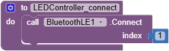
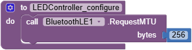
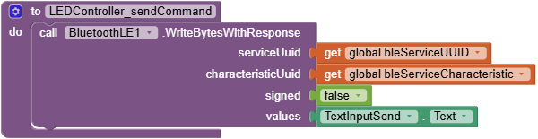

# Arduino Nano 33 BLE - iNoWa Beispiel

Beispiel zum Senden von Daten von einer Android App an eine Arduino Anwendung, die auf einem Arduino Nano 33 BLE läuft.

Die Android App wurde mit Hilfe des [MIT App Inventor](https://appinventor.mit.edu/) gebaut.

Für den Betrieb der WS2811 LED Kette in Verbindung mit dem Arduino Nano 33 BLE ist ein Pegelkonverter am Dateneingang erforderlich. Zum Beispiel der [4-channel I2C-safe Bi-directional Logic Level Converter - BSS138](https://www.adafruit.com/product/757) von Adafruit.

## Erläuterungen

### MIT App Inventor Erweiterungen

Für die Bluetooth Low Energy Unterstützung muss die [BluetoothLE](https://mit-cml.github.io/extensions/data/extensions/edu.mit.appinventor.ble-20240822.aix) (v20240822) Erweiterung installiert werden. Auf der Seite [MIT App Inventor Extensions](https://mit-cml.github.io/extensions/) kann nachgeschaut werden, ob neuere Versionen zur Verfügung stehen.

### App Blocks

#### Globale Variablen

Die Werte für die *Service UUID* und die *Service Characteristic UUID* werden in den globalen Variablen `bleServiceUUID` und `bleServiceCharacteristicsUUID` gespeichert.

#### LEDController_scanForDevice

Diese Funktion sucht nach einem Bluetooth Gerät mit einer vorgegebenen Service UUID.

Sobald das Gerät gefunden wird, wird das Ereignis `DeviceFound` ausgelöst.

#### LEDController_stopScanning

Diese Funktion beendet die Suche nach Bluetooth Geräten.

Der Scan Vorgang wird automatisch beendet, sobald er abgeschlossen wurde.

Er könnte aber auch programmatisch beendet werden, sobald eines der folgenden Ereignisse ausgelöst wird;

* `DeviceFound`
* `Connected`

#### LEDController_connect

Diese Funktion verbindet die Android App mit dem gefundenen Bluetooth Gerät.

Ein guter Zeitpunkt für `Connect` ist, wenn das Ereignis `DeviceFound` ausgelöst wird. Damit verbindet sich die Android App automatisch mit dem Bluetooth Geräte, sobald es gefunden worden ist.

#### LEDController_configure

Diese Funktion konfiguriert das Bluetooth Gerät hinsichtlich der maximal zu übertragenden Bytes. Standardmäßig liegt dieser Wert bei 32 Bytes abzüglich diverser Protokollbytes, so dass in der Regel um die 20 Bytes für Daten verbleiben. Die maximale Größe eines Datenpakets kann durch setzen der *Maximum Transaction Unit* (MTU) auf bis zu 256 Bytes überschrieben werden.

Ein guter zeitpunkt für das Setzen der MTU findet sich im Ereignis `Connected`.

#### LEDController_disconnect

Diese Funktion trennt die Verbindung zum Bluetooth Gerät.

Diese Funktion kann jederzeit durch den Benutzer oder programmatisch aufgerufen wwerden.

#### LEDController_writeBytesWithResponse

Diese Funktion sendet einen Bytefolge mit einer Länge kleiner/gleich der eingestellten MTU zum Bluetooth Gerät und wartet auf eine Bestätigung seitens des Geräts.

**Achtung:** Eigentlich wäre es aus Sicht der iNoWa App intuitiver, die Funktion `BluetoothLE1.WriteStringsWithResponse` aufzurufen. Diese Funktion scheint aber die gesetzte MTU nicht zu berücksichtigen. Daher wurde in diesem Beispiel auf `BluetoothLE1.WriteBytesWithResponse` zurückgegriffen.

## Siehe auch

* [MIT App Inventor](https://appinventor.mit.edu/)
* [MIT App Inventor - Bluetooth Low Energy Extension](https://github.com/mit-cml/appinventor-extensions/tree/extension/bluetoothle)
* [Download Bluetooth Low Energy Extension](https://mit-cml.github.io/extensions/data/extensions/edu.mit.appinventor.ble-20240822.aix)
* [MIT App Inventor - Extensions](https://mit-cml.github.io/extensions/)
* [Arduino Store](https://store.arduino.cc/en-de/products/arduino-nano-33-ble?srsltid=AfmBOoquMbIleJ2F_Nrln7l15mtdiEt-aQM-Gn_GX0p0JWSjtoa25Xyj)
* [Arduino Nano 33 BLE Produktbeschreibung](https://docs.arduino.cc/resources/datasheets/ABX00030-datasheet.pdf)
* [Adafruit WS2811 Produktbeschreibung](https://cdn-shop.adafruit.com/datasheets/WS2811.pdf)
* [Adafruit 4-channel I2C-safe Bi-directional Logic Level Converter - BSS138](https://www.adafruit.com/product/757)
* [Indoor Northwall - Die Boulderwand
zum selber bauen](https://i-nowa.com/)
